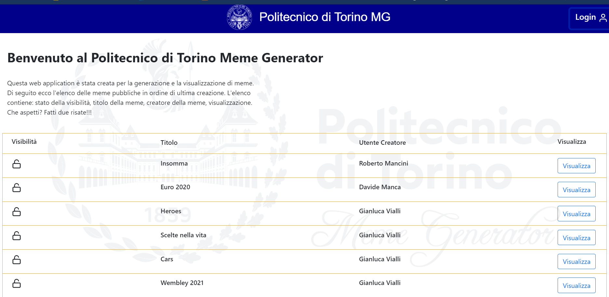
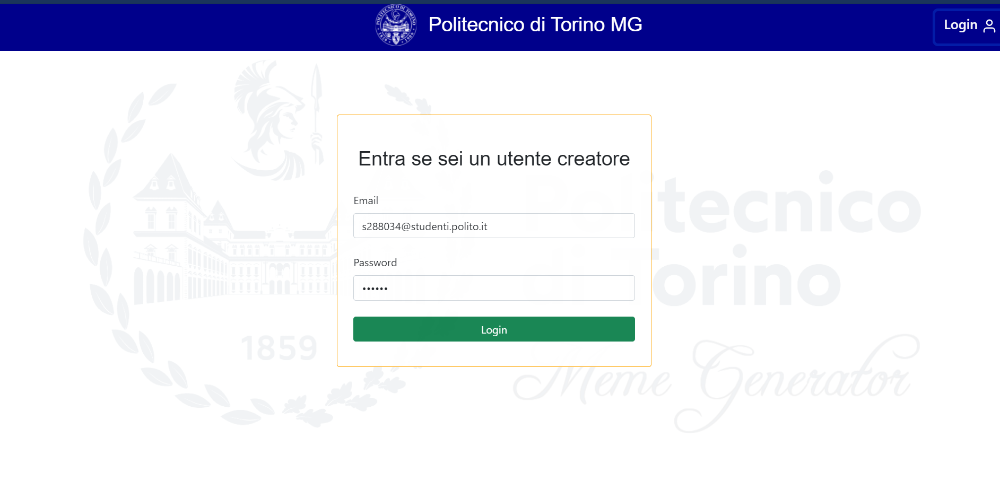
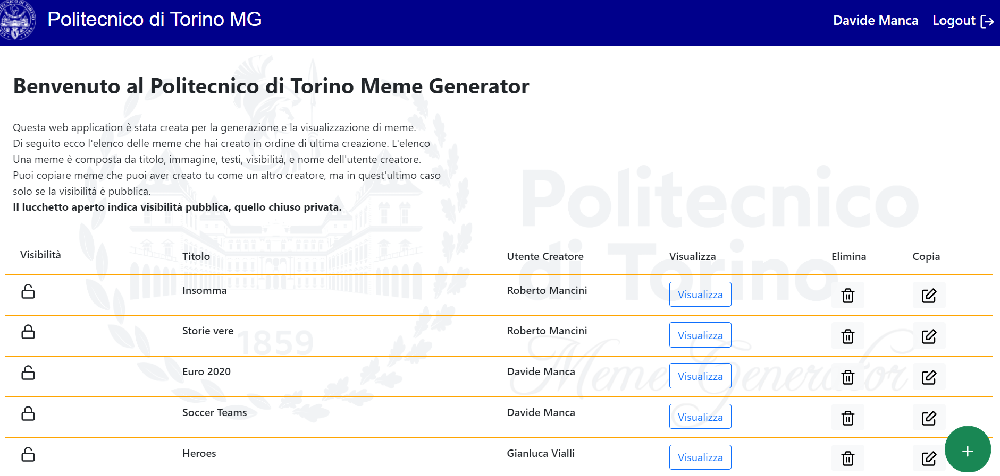

# Exam #2: "Meme Generator"
## Student: s288034 Manca Davide

## React Client Application Routes

- Route `/`: This route contains the public meme list composed of visibility, title, user creator, and view.
- Route `/login`: Login form which handles the authentication procedure by introducing correct credentials like username and password.
- Route `/Homepage` : It contains all of the authors meme list. It is possible to create a new meme, copying/modifying and deleting operations. The user creator logged in can delete only his memes but not the ones which has not created himself. Furthermore, the meme view is composed by all the meme properties.

## API Server

- POST `/api/login`
  - request parameters and request body content : 
  * username : Email of the user creator
  * password : the corresponding Password of the user creator who wants to log in
  - response body content : 
  * id : user creator id
  * Email : user creator Email
  * Name : user creator Name
  * Status code: 401 Unauthorized, if the authenticate goes wrong because of wrong credentials

- GET `/api/`
  - response body content :
  * meme list containig all of the availaible memes
  * Status code: 500, internal server error if the catch lambda function gets triggered 

- GET `/api/userCreator`
  - response body content :
  * meme list containing all of the memes created by the users creators
  * Status code: 500, internal server error if the catch lambda function gets triggered 

- GET `/api/visible/:visible`
  - request parameters : 
  * (params) visible = a parameter indicating the visibility of a meme, if it is public or protected
  - response body content :
  * public meme list
  * Status code: 500, internal server error if the catch lambda function gets triggered 

- POST `/api/addMeme`
  - request parameters and request body content:
  * meme : the meme which the user creator has just prepared to be submitted and hence processed to be add in the database.
  * user creator id
  - response body content
  * id : the id of the meme processed
  * Status code: 201 Created, if the creation has had no problem. 503 Service Unavailable, if the server is not momentarily availaible

- PUT `/api/aggiorna/:id`
  - request parameters : 
  * (params) id = the id of the meme to be updated
  * meme: the meme which a user creator want to update and to copy with the associated visibility by modifying some meme parameter 
  - response body content :
  * updated meme with the new parameters first of all the user creator.
  * Status code: 200 OK, if the operation ends with no errors or 503 Service Unavailable, if the server is not momentarily availaible.

- DELETE `/api/elimina/:id`
  - request parameters and request body content:
  * id : id of the meme to delete
  * user creator id: id of the logged in user creator who can delete only his own created or copied meme, obviously if he is logged in
  - response body content
  * meme id: the id of the meme deleted
  * Status code: 204 No Content. If the server has processed correctly the deleting operation. 503 Service Unavailable, if the server is not momentarily availaible.

- GET `/api/memeId/:id`
  - request parameters : 
  * (params) id = the id of a certain meme
  - response body content :
  * the return meme indetified by the given id in the request parameters.
  * Status code: 500, nternal server error if the catch lambda function gets triggered 

## Database Tables

- Table `utentiCreatori` - contains the id, username (Email) and password (Password)of each users creators.
- Table `meme` - contains id, title (titolo),image (immagine) considered as an integer number referencing the name of the image itself, first text (testo1), second text (testo2) and third text (testo3) of each meme. In addition, there is a boolean (comicSans) which indicates the font between Comic Sans Ms and Impact. There is also an integer to choose one of five colors, an id related to the meme's user creator and the visibility field that indicates if a meme is public or protected.

## Main React Components

- `CopyComponent` (in `CopyComponents.js`): It handles the meme copy and edit operations. It shows a form with the meme features to be eventually edited.
- `FormComponent` (in `FormComponents.js`): It handles the meme creation and adding operation.
- `LoginForm` (in `LoginComponents.js`): It contains a form where a user creator can insert its credentials to log in.
- `MemeGeneratorComponent` (in `MemeGeneratorComponents.js`): It display the features of each meme for a user creator and the meme with the texts overlapped for a public user 
- `MemeList` (in `memeListComponents.js`): It retrieve the list of all memes. If there no user creator get authenticated it show only the public memes on the main table, otherwise it displays all of the creator availaible meme after the authentication.
- `NavMenu` (in `NavbarComponents.js`): It displays the sticked on the top navbar. If nobody logs in as a user creator, it show a button where an user can turn into user creator by logged in. Once logged in, the user creator finds a button to log out and, on the left, the name of the user creator logged into.
- `PlusButton` (in `PlusComponents.js`): It is showed only inside the route "/Homepage", hence if when a creator is authenticated. By clicking it a form appears and so it is possible to create a new meme.

## Screenshot

## Users Credentials

- s288034@studenti.polito.it, davide
- robertomancini@gmail.com, roberto
- gianlucavialli@libero.it, gianluca
